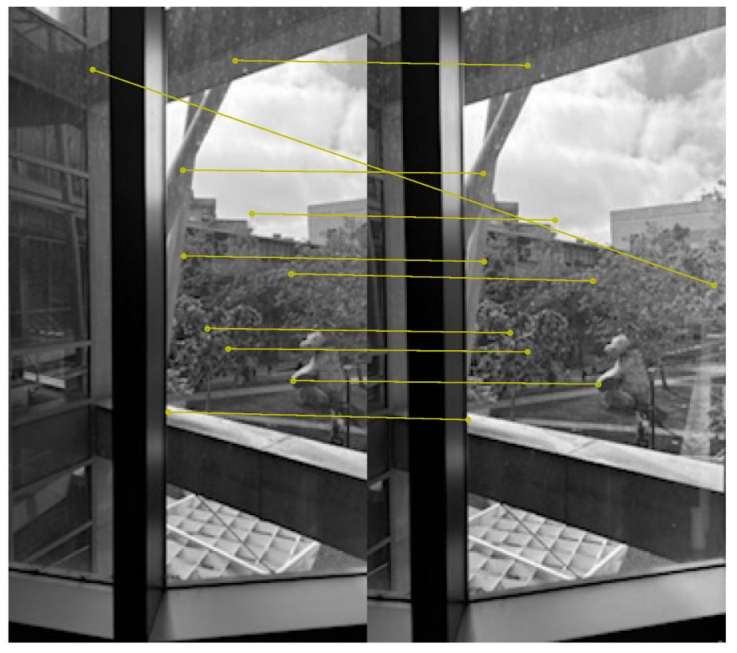
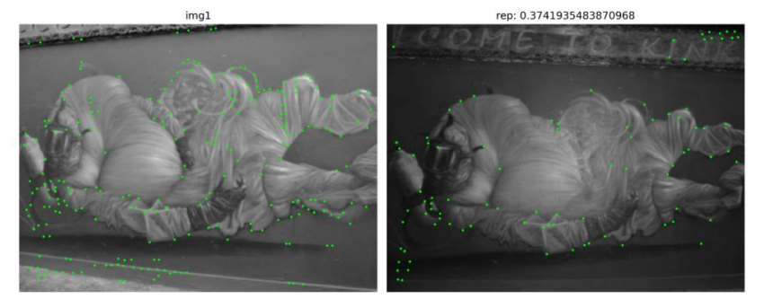

# Monocular Visual Odometry and SfM

This project evaluates local feature detection, description, and matching methods
under viewpoint and illumination changes, and studies embedding-based image retrieval.

## Methods
- Compared Harris, SIFT, MagicPoint, and SuperPoint
- Evaluated repeatability, localization error, matching score, and NN mAP
- Applied homographic adaptation for improved robustness
- Trained an embedding model for image retrieval on FashionMNIST
- Evaluated retrieval performance using precision@1

| Image A | Image B |
|--------|--------|
|  |  |

[Project Report (PDF)](report1.pdf)

